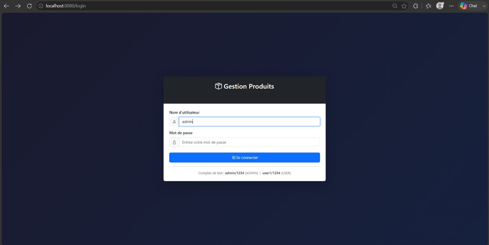
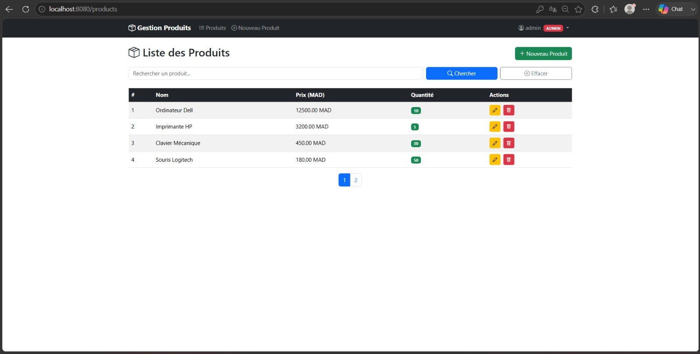
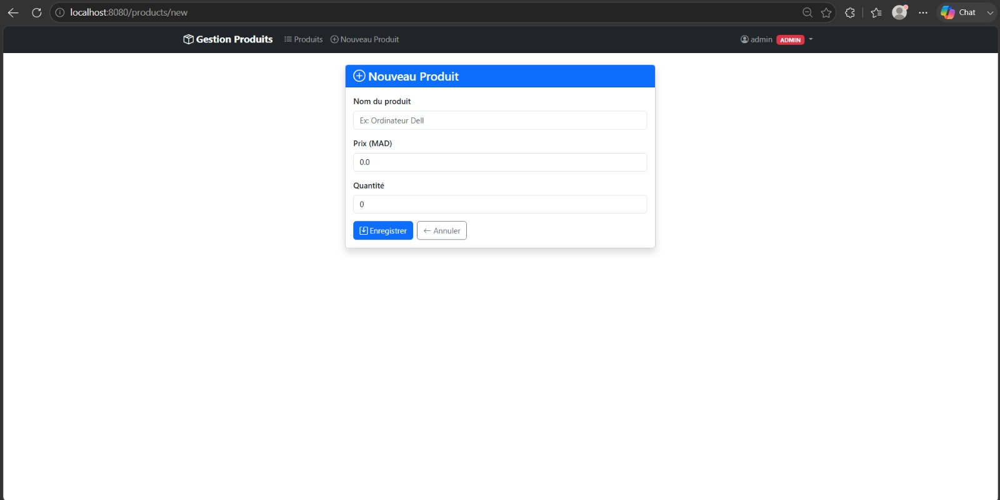
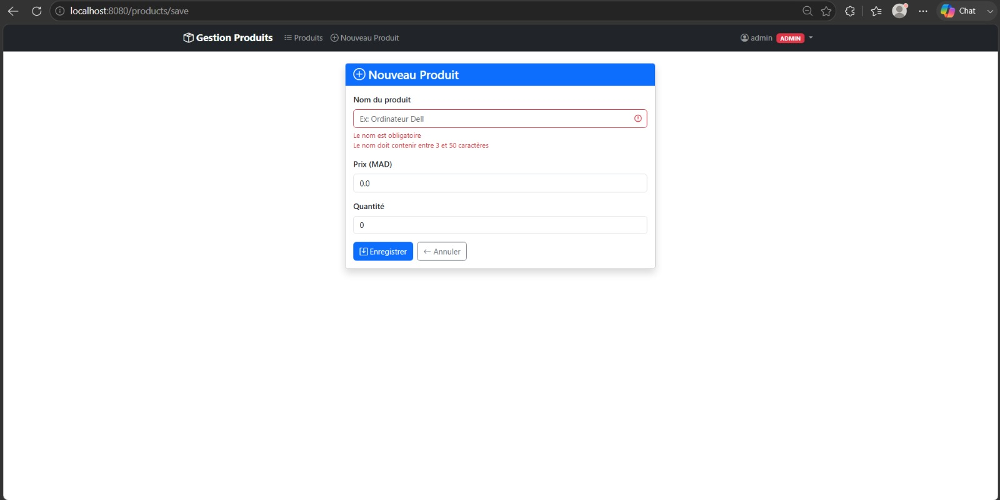
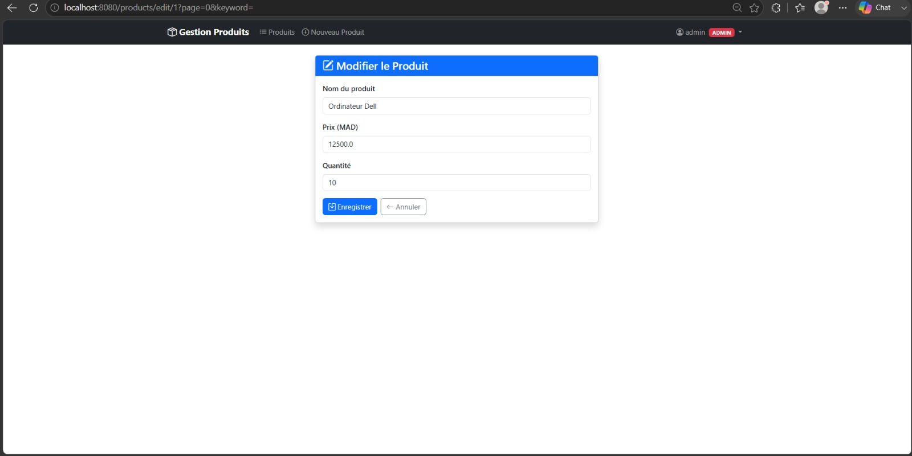
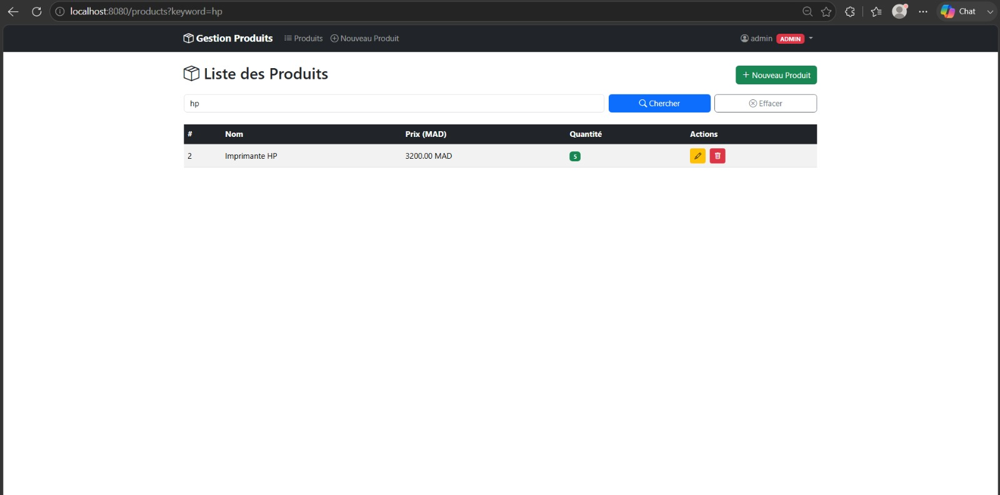
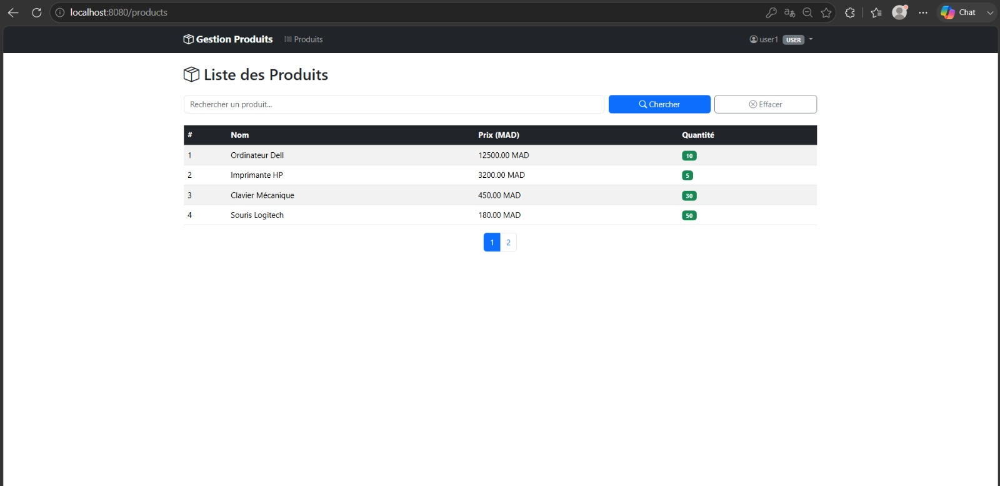

# Gestion de Produits — Application Web Spring Boot

**Auteur :** Nihade Ouassekssou

Application web de gestion de produits (CRUD, recherche et pagination) construite avec
**Spring MVC**, **Spring Data JPA / Hibernate**, **Thymeleaf** et **Spring Security**.
L'accès est protégé par une authentification par formulaire et une autorisation par rôles
(`ADMIN` / `USER`). Le projet est un module Spring Boot unique ([`tp3-webapp/`](tp3-webapp/)).

## Description

Architecture en trois couches (vues Thymeleaf → contrôleurs → persistance JPA), filtrées en
amont par Spring Security. Chaque composant du code :

### Point d'entrée et jeu de données de démonstration
[`Tp3WebappApplication`](tp3-webapp/src/main/java/ma/ouassekssou/Tp3WebappApplication.java)
démarre l'application et expose un `CommandLineRunner` (`initData`) qui insère 8 produits de
démonstration au lancement, puis affiche un test de la couche DAO dans la console (nombre de
produits, puis la liste via `toString`).

### Entité `Product`
[`Product`](tp3-webapp/src/main/java/ma/ouassekssou/entities/Product.java) est une entité JPA
(`@Entity`) avec un identifiant auto-généré (`GenerationType.IDENTITY`) et des contraintes
Bean Validation : `@NotBlank` + `@Size(min=3, max=50)` sur le nom, `@Min(0)` sur le prix et
la quantité. Lombok (`@Data`, `@NoArgsConstructor`, `@AllArgsConstructor`) génère les
getters/setters, les constructeurs, `toString`, `equals`/`hashCode`.

### Repository `ProductRepository`
[`ProductRepository`](tp3-webapp/src/main/java/ma/ouassekssou/repositories/ProductRepository.java)
étend `JpaRepository<Product, Long>` (CRUD standard) et ajoute une recherche paginée dérivée :
`Page<Product> findByNameContainsIgnoreCase(String keyword, Pageable pageable)` — filtrage par
mot-clé, insensible à la casse.

### Contrôleur `ProductController`
[`ProductController`](tp3-webapp/src/main/java/ma/ouassekssou/controllers/ProductController.java)
expose les fonctionnalités métier :
- `GET /` et `GET /products` : liste paginée (4 produits par page) avec recherche par mot-clé.
- `GET /products/new` : formulaire de création.
- `GET /products/edit/{id}` : formulaire pré-rempli pour l'édition.
- `POST /products/save` : validation (`@Valid`) puis création ou mise à jour ; en cas d'erreur,
  le formulaire est ré-affiché avec les messages. Un message flash de confirmation est ajouté
  via `RedirectAttributes`.
- `GET /products/delete/{id}` : suppression + message flash, en conservant la page et le
  mot-clé courants.

### Contrôleur `AuthController`
[`AuthController`](tp3-webapp/src/main/java/ma/ouassekssou/controllers/AuthController.java)
expose les pages `GET /login` et `GET /403` (accès refusé personnalisé).

### Sécurité `SecurityConfig`
[`SecurityConfig`](tp3-webapp/src/main/java/ma/ouassekssou/security/SecurityConfig.java) :
- Authentification par formulaire (`formLogin`) avec page `/login` personnalisée.
- 3 utilisateurs en mémoire (`InMemoryUserDetailsManager`), mots de passe encodés en **BCrypt** :
  `admin` (rôles `USER` + `ADMIN`), `user1` et `user2` (rôle `USER`).
- Autorisation par rôle : seul `ADMIN` peut accéder à `/products/new`, `/products/save`,
  `/products/edit/**` et `/products/delete/**` ; toute autre requête exige une authentification.
  La console H2 et les ressources statiques (`/css/**`, `/webjars/**`) restent ouvertes.
- Page d'accès refusé dédiée (`/403`), `frameOptions sameOrigin` et exclusion CSRF pour la
  console H2.

### Vues Thymeleaf
Layout partagé ([`layout/template.html`](tp3-webapp/src/main/resources/templates/layout/template.html))
avec navbar Bootstrap 5 et menu utilisateur ; les actions réservées à l'`ADMIN` sont masquées
côté vue via `sec:authorize`. Pages :
[`products/list.html`](tp3-webapp/src/main/resources/templates/products/list.html) (recherche,
pagination, badges de stock),
[`products/form.html`](tp3-webapp/src/main/resources/templates/products/form.html)
(création/édition avec retours d'erreurs),
[`security/login.html`](tp3-webapp/src/main/resources/templates/security/login.html) et
[`security/403.html`](tp3-webapp/src/main/resources/templates/security/403.html).

## Technologies utilisées

| Technologie | Version | Rôle |
|---|---|---|
| Java | 17 | Langage (`pom.xml` : `java.version`) |
| Spring Boot | 3.2.5 | Socle + auto-configuration (parent POM) |
| Spring MVC (Spring Framework) | 6.1.6 | Contrôleurs web `@Controller` |
| Spring Data JPA | 3.2.5 | Repositories / couche de persistance |
| Hibernate ORM | 6.4.4.Final | Implémentation JPA |
| Spring Security | 6.2.4 | Authentification + autorisation |
| Thymeleaf | 3.1.2.RELEASE | Moteur de templates |
| Thymeleaf Layout Dialect | 3.3.0 | Layout partagé (`layout:decorate`) |
| Thymeleaf Extras Spring Security 6 | 3.1.2.RELEASE | Attribut `sec:authorize` dans les vues |
| H2 Database | 2.2.224 | Base en mémoire (par défaut) |
| MySQL Connector/J | 8.3.0 | Pilote MySQL (migration optionnelle) |
| Lombok | 1.18.32 | Génération de code (getters/setters, `toString`…) |
| Bootstrap / Bootstrap Icons | 5.3.3 / 1.11.3 | Interface (chargés via CDN) |
| Maven | 3.9.9 | Outil de build |

> Seuls Java 17 et Spring Boot 3.2.5 sont figés explicitement dans `pom.xml`. Les autres
> versions sont celles gérées par le BOM Spring Boot 3.2.5 et résolues par Maven (relevées
> via `mvn dependency:list`).

## Structure du code

Package racine : `ma.ouassekssou`

| Package | Classe / Fichier | Rôle |
|---|---|---|
| `ma.ouassekssou` | `Tp3WebappApplication` | Point d'entrée + `CommandLineRunner` (seed + test DAO) |
| `ma.ouassekssou.entities` | `Product` | Entité JPA + contraintes Bean Validation |
| `ma.ouassekssou.repositories` | `ProductRepository` | `JpaRepository` + recherche paginée |
| `ma.ouassekssou.controllers` | `ProductController` | Liste (pagination + recherche), création, édition, suppression |
| `ma.ouassekssou.controllers` | `AuthController` | Pages `/login` et `/403` |
| `ma.ouassekssou.security` | `SecurityConfig` | Authentification par formulaire + autorisation par rôle (BCrypt) |
| `templates/layout` | `template.html` | Layout partagé (navbar, `sec:authorize`, déconnexion) |
| `templates/products` | `list.html`, `form.html` | Liste et formulaire création/édition |
| `templates/security` | `login.html`, `403.html` | Connexion et accès refusé |

### Diagramme des relations

```
   Navigateur
      │  HTTP
      ▼
 ┌─────────────────────────────────────────────────┐
 │            Spring Security (filtres)             │
 │   authentification par formulaire + rôles        │
 └───────────────────────┬─────────────────────────┘
                         │  requête autorisée
              ┌──────────▼──────────────┐
              │  Contrôleurs @Controller │
              │  ProductController        │
              │  AuthController           │
              └─────┬───────────────┬────┘
           rend     │               │   utilise
                    ▼               ▼
        ┌────────────────┐   ┌────────────────────┐
        │ Vues Thymeleaf │   │ ProductRepository  │
        │ layout + list  │   │ (Spring Data JPA)  │
        │ + form (BS5,   │   └─────────┬──────────┘
        │ sec:authorize) │             │  mappe
        └────────────────┘   ┌─────────▼──────────┐
                             │  Entité Product     │
                             └─────────┬──────────┘
                                Hibernate ORM
                             ┌─────────▼──────────┐
                             │  H2 (défaut) / MySQL│
                             └────────────────────┘
```

Le domaine ne comporte qu'une seule entité (`Product`), sans association JPA : il n'y a donc
pas de relation entre entités, mais des relations de dépendance entre couches
(contrôleur → repository → entité → base).

## Notes techniques

- **Défense en profondeur (sécurité).** Les vues masquent les actions réservées à l'`ADMIN`
  avec `sec:authorize` (bouton « Nouveau Produit », colonne Actions), mais le contrôle réel
  est appliqué côté serveur par `SecurityConfig` (`hasRole("ADMIN")`). Masquer un bouton ne
  remplace jamais un contrôle serveur.
- **Mots de passe encodés.** Les utilisateurs en mémoire sont stockés via un
  `BCryptPasswordEncoder`.
- **Validation côté serveur.** Les contraintes Bean Validation de `Product` sont vérifiées par
  `@Valid` dans `saveProduct` ; en cas d'erreur, le formulaire est ré-affiché avec les
  messages (`th:errors`) sans perdre la saisie.
- **Recherche et pagination.** Assurées par la requête dérivée
  `findByNameContainsIgnoreCase(keyword, PageRequest.of(page, size))` (4 éléments par page par
  défaut).
- **Lombok.** `@Data` génère notamment le `toString` de `Product` — c'est ce format que l'on
  retrouve dans la sortie console du test DAO ci-dessous.

## Configuration de la base de données

Par défaut, l'application utilise **H2 en mémoire**
([`application.properties`](tp3-webapp/src/main/resources/application.properties)) :

```properties
spring.datasource.url=jdbc:h2:mem:tp3db
spring.jpa.hibernate.ddl-auto=create-drop
spring.h2.console.enabled=true        # console : http://localhost:8080/h2-console
```

Un bloc **MySQL** prêt à l'emploi est fourni en commentaire dans le même fichier : il suffit de
commenter le bloc H2 et de décommenter le bloc MySQL
(`jdbc:mysql://localhost:3306/tp3db?createDatabaseIfNotExist=true`, `ddl-auto=update`).

## Exécution

Prérequis : **JDK 17** et **Maven**.

```bash
cd tp3-webapp
mvn spring-boot:run
```

L'application démarre sur **http://localhost:8080** (toute requête non authentifiée est
redirigée vers `/login`). Comptes de test :

| Utilisateur | Mot de passe | Rôles |
|---|---|---|
| `admin` | `1234` | USER + ADMIN |
| `user1` | `1234` | USER |
| `user2` | `1234` | USER |

Au lancement, le `CommandLineRunner` insère les 8 produits de démonstration et affiche le test
de la couche DAO :

```
========== TEST COUCHE DAO ==========
Nombre de produits : 8
Product(id=1, name=Ordinateur Dell, price=12500.0, quantity=10)
Product(id=2, name=Imprimante HP, price=3200.0, quantity=5)
Product(id=3, name=Clavier Mécanique, price=450.0, quantity=30)
Product(id=4, name=Souris Logitech, price=180.0, quantity=50)
Product(id=5, name=Ecran Samsung 24", price=4200.0, quantity=15)
Product(id=6, name=Webcam HD, price=650.0, quantity=20)
Product(id=7, name=Casque Audio, price=890.0, quantity=12)
Product(id=8, name=Disque SSD 1To, price=1200.0, quantity=25)
```

## Captures d'écran

**Connexion** — page `/login` (non authentifié) :



**Liste des produits (admin)** — bouton « Nouveau Produit », badge **ADMIN** et colonne
Actions visibles pour ce rôle :



**Formulaire d'ajout** — `/products/new` :



**Validation du formulaire** — soumission avec un nom vide : les messages Bean Validation
(`@NotBlank`, `@Size`) s'affichent sans quitter le formulaire :



**Édition d'un produit** — `/products/edit/{id}`, formulaire pré-rempli avec les valeurs
existantes :



**Recherche** — filtre par mot-clé (« hp ») :



**Liste des produits (user)** — connecté en `user1` : ni le bouton « Nouveau Produit » ni la
colonne Actions ne sont visibles (rôle USER, lecture seule) :



### Comportement d'autorisation (routes protégées)

| Requête | Anonyme | `user1` (USER) | `admin` (ADMIN) |
|---|---|---|---|
| `GET /products` | 302 → `/login` | 200 (lecture seule) | 200 (actions visibles) |
| `GET /products/new` | 302 → `/login` | 403 (accès refusé) | 200 (formulaire) |
| `GET /products/edit/{id}` | 302 → `/login` | 403 | 200 (pré-rempli) |
| `GET /products/delete/{id}` | 302 → `/login` | 403 | 302 → `/products` (supprimé) |

L'enregistrement (`POST /products/save`) suit la même règle : réservé à `ADMIN` ; en cas de
données invalides, le formulaire est ré-affiché avec les messages d'erreur.

## Conclusion

L'application illustre une architecture MVC en couches sur Spring Boot : contrôleurs
`@Controller`, vues Thymeleaf avec layout partagé et Bootstrap, persistance via Spring Data
JPA / Hibernate, et sécurité par formulaire avec autorisation par rôle. La validation Bean
Validation, la recherche paginée dérivée et la défense en profondeur (côté vue et côté serveur)
en constituent les points techniques principaux. La bascule H2 → MySQL est préparée dans
`application.properties` et ne demande que de commuter les deux blocs de configuration.
